  
Update: May 9, 2019

## Introduction

This workshop will walk you through the process of deploying **Pivotal Cloud Foundry (PCF)** on **Microsoft Azure**. We will stand up **Concourse** using **Pivotal Control Plane** and deploy PCF using **Platform Automation**. For complete documentation check out [Pivotal Control Plane](https://control-plane-docs.cfapps.io/)

***To log issues***, click here to go to the [github](https://github.com/dfoleypivotal/azure-platform-automation-example/issues) repository issue submission form.

## Objectives

- [Install Pivotal Control Plane](#install)
- [Login to Concourse](#concourse)
- [Deploy PCF using Concourse Pipeline - TODOe](#pipeline)

## Required Artifacts

- The following lab requires a Microsoft Azure account.
- A registered domain name is required to deploy PCF.
- [Terraform](https://www.terraform.io/downloads.html)
- [OM CLI](https://github.com/pivotal-cf/om)
- [BOSH CLI](https://github.com/cloudfoundry/bosh-cli/releases)

<a id="install"></a>

## Install Pivotal Control Plane

**Control Plane** is an automation environment intended to execute **PCF Automation** tools to manage multiple PCF foundations in an automated fashion. In general, automation will help you update foundations without close attention and enable more team members to confidently upgrade or create PCF environments. This in turn will free up more time for those who operate a PCF platform for their business.

### **STEP 1**: Clone Terraform template repository

- Open a terminal window and change to working directory. For documentation, working directory location will be `/Users/dfoley/development/Azure`.

```bash
cd /Users/dfoley/development/Azure
```

- Clone workshop repository

```bash
git clone https://github.com/dfoleypivotal/azure-platform-automation-example.git
```

- Clone terraforming-azure repository

```bash
git clone https://github.com/dfoleypivotal/terraforming-azure.git
cd terraforming-azure/terraforming-control-plane/
```


### **STEP 2**: Create an Automation Account

- First, find your account by running the following commands using the [Azure CLI](https://docs.microsoft.com/en-us/cli/azure/install-azure-cli?view=azure-cli-latest)

```bash
az login
az account list
```


**Note:** Copy **Id** an **Tenant Id** as these values will be used later in the lab.

- Create Service Account for Bosh. For more details please view [Azure Documentation](https://docs.microsoft.com/en-us/cli/azure/ad/sp?view=azure-cli-latest)

```bash
az ad sp create-for-rbac --name ServicePrincipalforBosh<your initials>
```

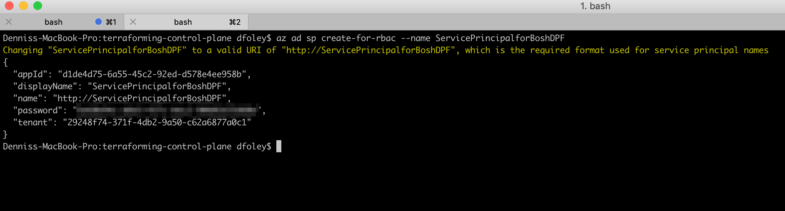


- If you want to verify that the service principal was create you can login to the Azure Console. Click **Azure Active Directory** then **App registrations** and you will see the new **ServicePrincipalforBosh** application was created.

    

### **STEP 3**: Pave IaaS using Terraform

- Using the output from the previous steps create and populate the **terraform.tfvars** file with the content below.

```bash
subscription_id = "Your Subscription Id"
tenant_id       = "Your Tenant ID"
client_id       = "appId from previous call"
client_secret   = "password from previous call"

env_name              = "controlplane"
ops_manager_image_uri = "https://opsmanagerwestus.blob.core.windows.net/images/ops-manager-2.4-build.192.vhd"
location              = "WestUS2"
dns_suffix            = "domain.com"

dns_subdomain         = "pcfcontrolplane"
```

- Create Infrastructure 

```bash
terraform init
terraform apply -auto-approve
```


- Back on the Azure Console, you will see that a resource group named **controlplane** has been created and you can view all the resources that where created.

    

- Create an NS record on the parent DNS Zone with the records returned by the following. You can test 

```bash
terraform output env_dns_zone_name_servers
```


- Verify connectivity with the following command:

```bash
dig pcfcontrolplane.<your domain> NS +short
```


### **STEP 4**: Configure BOSH Director

- From any browser, access Ops Manger using URL defined by:

```bash
echo https://"$(terraform output ops_manager_dns)"
```


- Follow the Pivotal documentation [Configuring BOSH Director on Azure](https://docs.pivotal.io/pivotalcf/2-4/om/azure/config-manual.html)

**Note:** On the *Create Networks Page* only create one network, following the *infrastructure* network guide, and set the *Name* field to **control-plane**

- For automated configuration run script **deploy-om-director.sh**

```bash
../../azure-platform-automation-example/scripts/deploy-om-director.sh
```

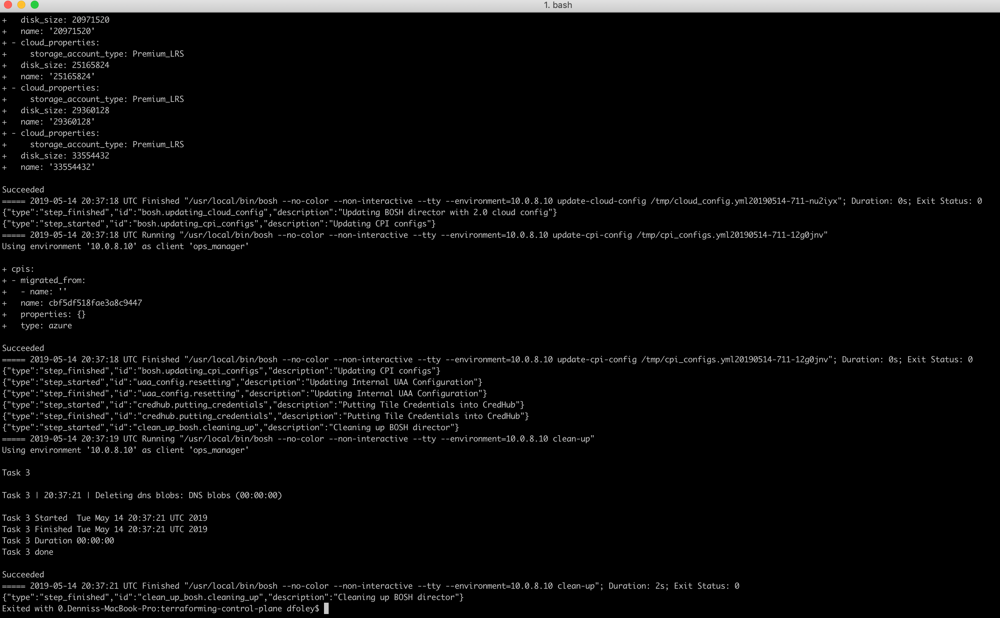

### **STEP 5**: Deploy Control Plane via Manifest

- TO make the process of downloading and uploading the **Control Plane Components** you will us the PivNet CLI running from the Ops Manager VM. You will modify to scripts. First script will install the PivNet CLI on the Ops Manager VM and the second will download and upload the required components.

- First let setup our environment for BOSH deployment

- Save the Ops Manager SSH KEY to an environment variable (the ***OPS_MANAGER_KEY_PATH*** variable can be arbitrary)

```bash
export OPS_MANAGER_KEY_PATH=./ops_manager_ssh_private_key

terraform output ops_manager_ssh_private_key > $OPS_MANAGER_KEY_PATH
chmod 0600 $OPS_MANAGER_KEY_PATH
```


- Save the Ops Manager environment variables for connecting with the om CLI

```bash
export OM_TARGET="https://$(terraform output ops_manager_dns)"
export OM_USERNAME="admin"
export OM_PASSWORD="$(terraform output ops_manager_password)"
export OM_IP="$(terraform output ops_manager_ip)"
```


- Set environment variables for connecting to BOSH

```bash
eval "$(om --skip-ssl-validation bosh-env --ssh-private-key $OPS_MANAGER_KEY_PATH)"
```

- Using your favorite editor modify the **setupPivNet.sh** to include your PivNet API Token.

```bash
vi ../../azure-platform-automation-example/scripts/setupPivNet.sh
```

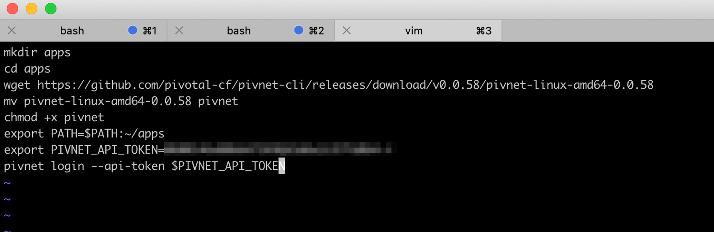

- Next we will update the script **getControlPlaneComponents** with BOSH environment variable.

```bash
env | grep BOSH
vi ../../azure-platform-automation-example/scripts/getControlPlaneComponents_v31.sh
```

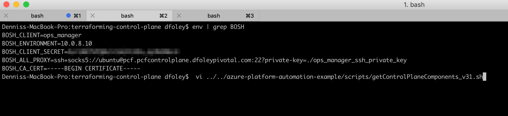
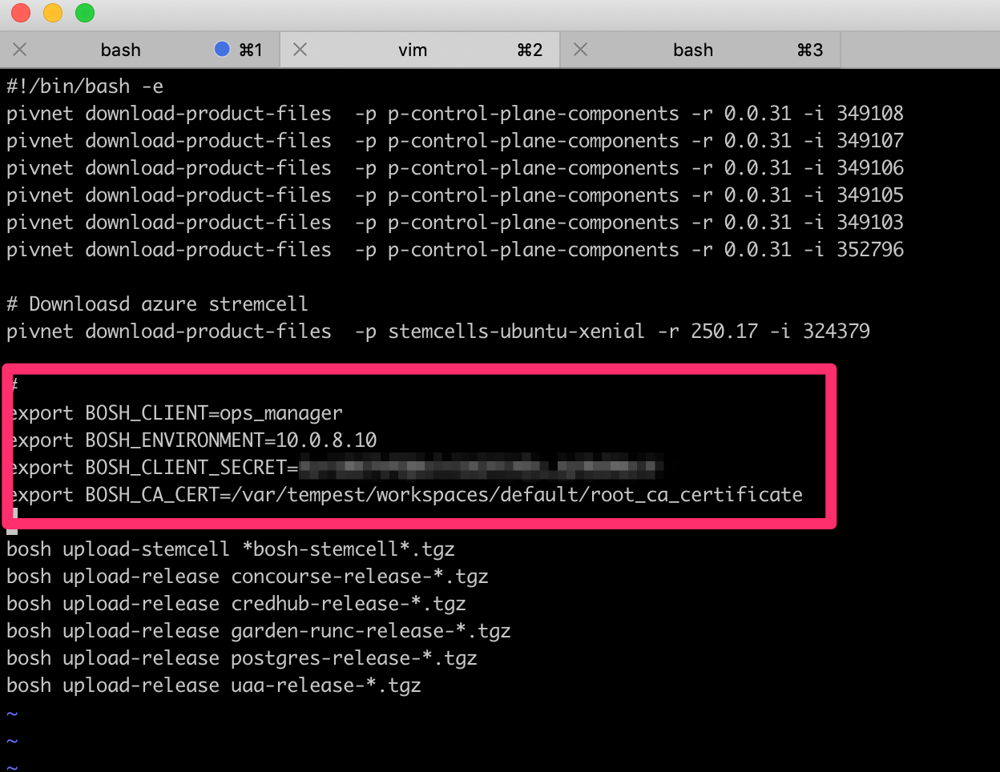

- Now copy the scripts over to the Ops Manager VM and SSH onto the VM

```bash
scp -i $OPS_MANAGER_KEY_PATH ../../azure-platform-automation-example/scripts/setupPivNet.sh ubuntu@$OM_IP:~/.
scp -i $OPS_MANAGER_KEY_PATH ../../azure-platform-automation-example/scripts/getControlPlaneComponents_v31.sh ubuntu@$OM_IP:~/.
ssh -i $OPS_MANAGER_KEY_PATH ubuntu@$OM_IP
```

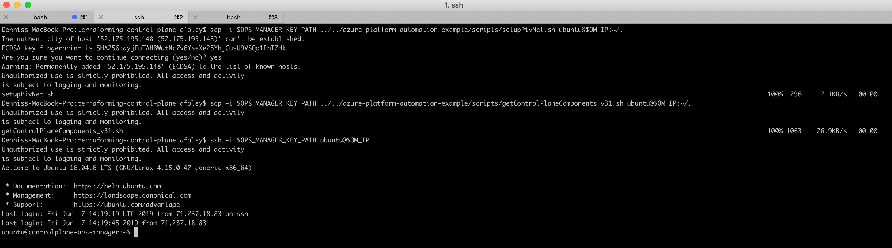

- Run script **setupPivNet.sh** to install PivNet CLI

```bash
source setupPivNet.sh
```

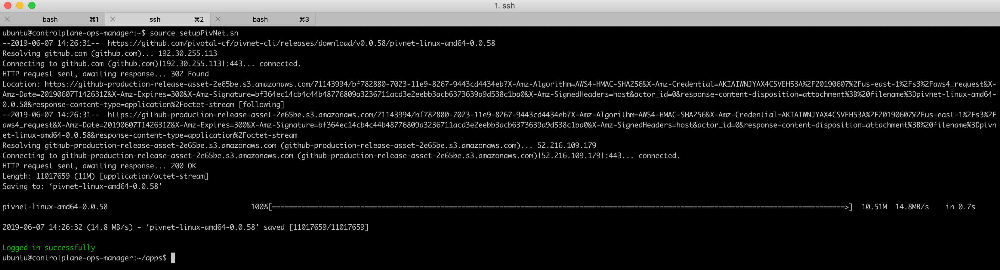

- Copy script **getControlPlaneComponents_v31.sh** to newly created apps directory and execute.

```bash
cp ../getControlPlaneComponents_v31.sh .
source getControlPlaneComponents_v31.sh
```

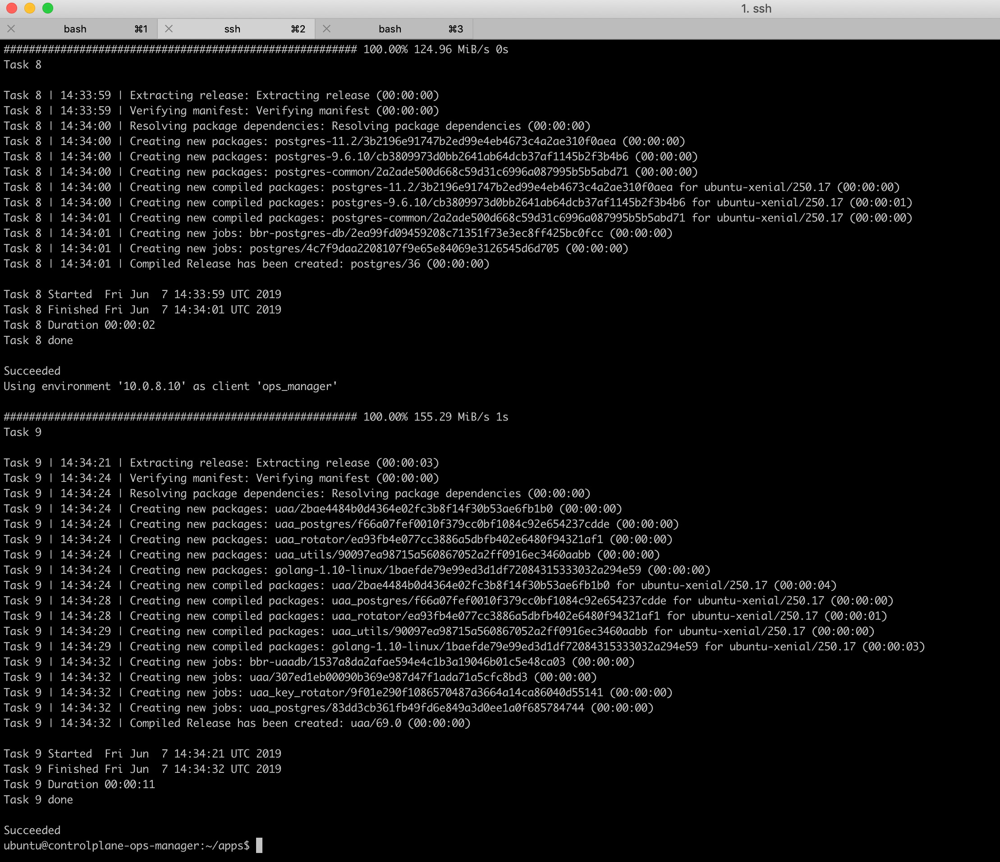

- Exit Ops Manager VM and copy to Control Plane YAML file to your local machine.

```bash
scp -i $OPS_MANAGER_KEY_PATH ubuntu@$OM_IP:~/apps/control-plane*.yml .
```

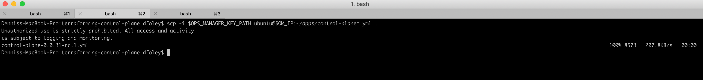

- Retrieve the Control Plane domain.

```bash
export CONTROL_PLANE_ROOT_DOMAIN="$(terraform output control_plane_domain)"
```

- Make a **bosh-vars.yml** to hold these deployment vars:

```vi
---
external_url: https://plane.pcfcontrolplane.<your domain>
persistent_disk_type: 1048576
vm_type: Standard_F4s
azs: ["null"]
network_name: control-plane
wildcard_domain: "plane.pcfcontrolplane.<your domain>"
uaa_url: https://uaa.pcfcontrolplane.<your domain>
uaa_ca_cert: |
  $(credhub get -n /p-bosh/control-plane/control-plane-tls -k certificate | awk ‘{printf “%s\r\n  “, $0}’)
 ```

- Create  an operations file **azure-vm-extension.yml** with a single operation that replaces value of **vm_extension**.

```vi
- type: replace
  path: /instance_groups/name=web/vm_extensions?
  value: [control-plane-lb]
  ```
 

- Deploy the manifest from the Ops Manager VM

```bash
bosh deploy -d control-plane control-plane-*.yml \
  --vars-file=./bosh-vars.yml \
  --ops-file=./azure-vm-extension.yml
```

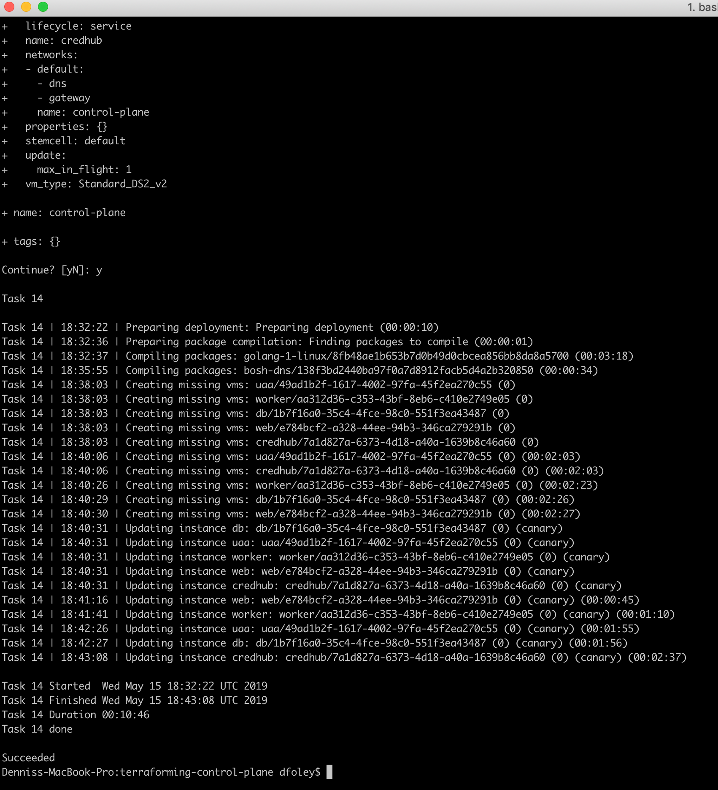


- Run the following command to verify that the deployment instances are running:

```bash
bosh instances -d control-plane
```

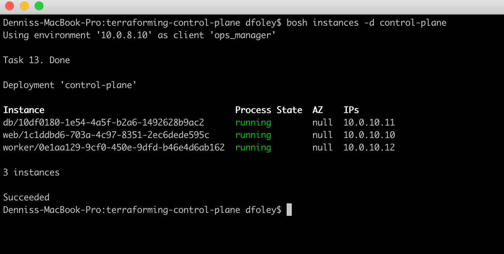

<a id="concourse"></a>

## Login to Control Plane

### **STEP 6**: Login to Control Plane UI

- You should also be logged into credhub if you have used the **om bosh-env eval** line from above. This allows you to easily get the credential we need to test the login of our control-plane.

```bash
credhub get -n $(credhub find | grep uaa_users_admin | awk '{print $3}')
```

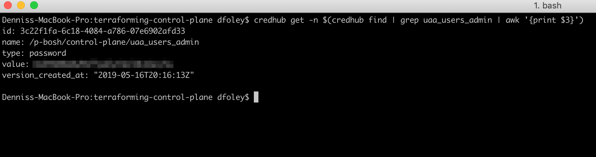

- From any browser, access Concourse UI using URL defined by:

```bash
echo https://"$(terraform output control_plane_domain)"
```

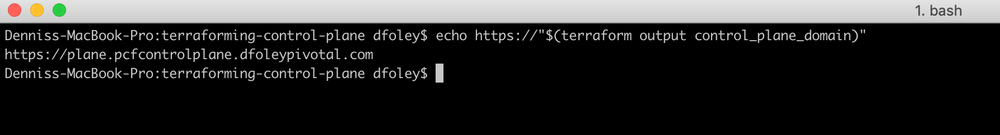

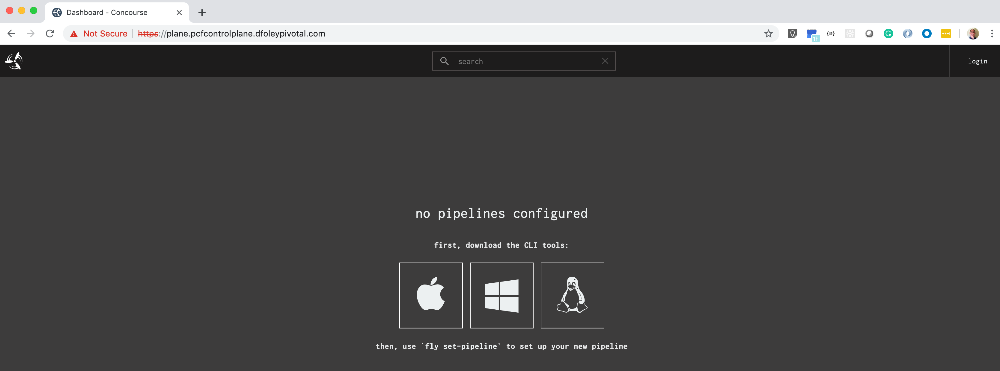

- CLick **login** in the upper right hand corner.

- Enter **admin** for the `username`, and the password retrieved from Credhub as the `password` and click **SIGN IN**.

  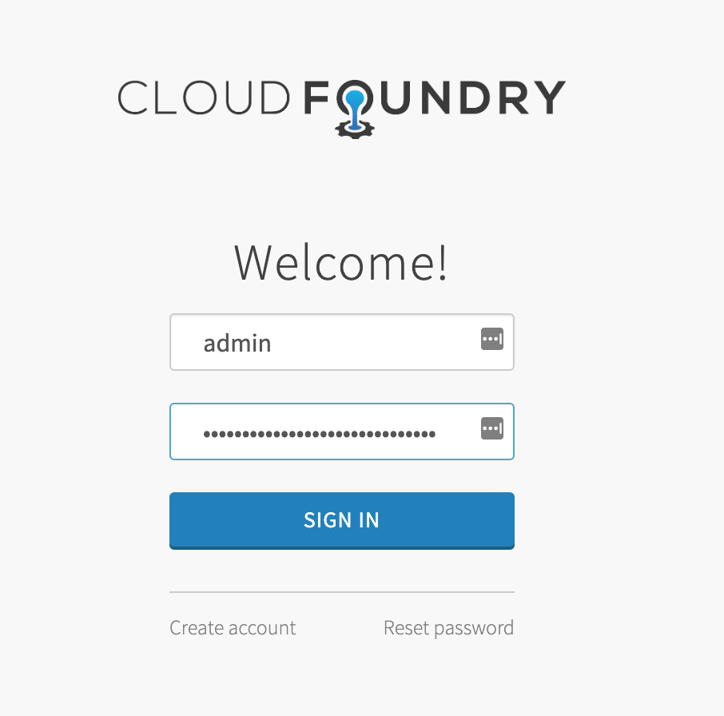

- Click **Authorize** 

**Note:** If the redirect fails, refresh the browser and click login again

  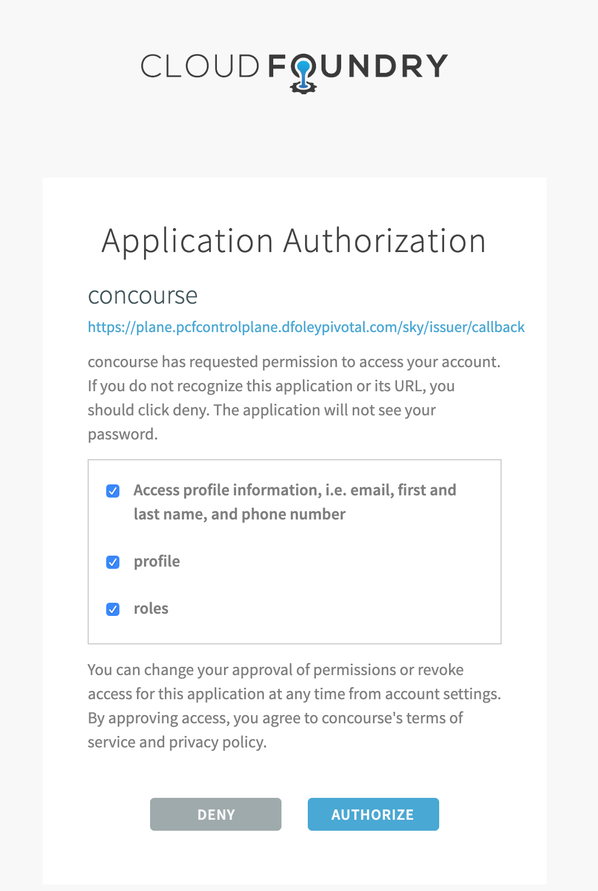

### **STEP 7**: Login using FLY CLI

- If you don't already have the **fly cli** install you can download from the concourse page. Just click on the icon for you operating system.

  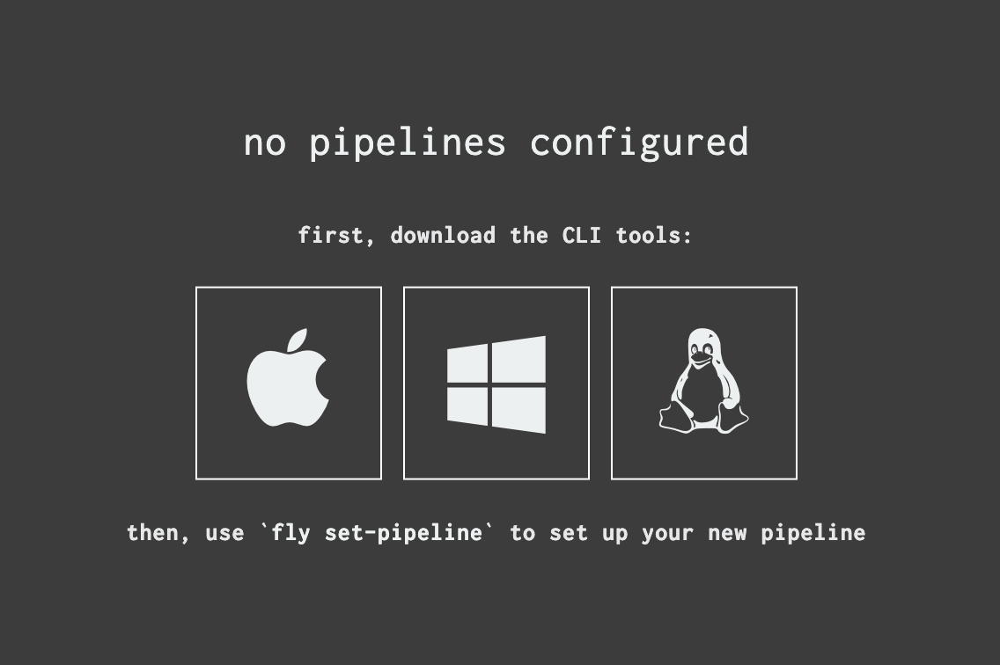

- After the **fly cli** is downloaded make it executable and copy to a location in your path.

  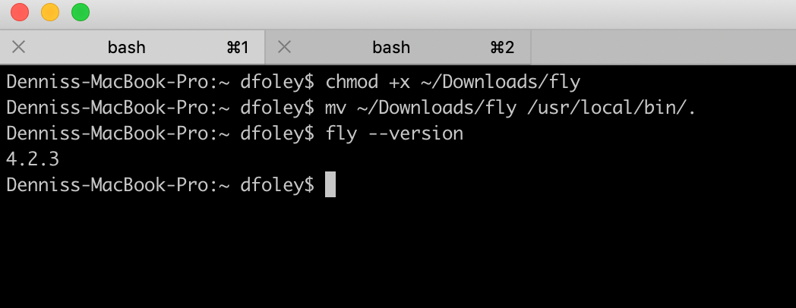

- login to Concourse using the main team. 

**Note:** You will be ask to authenticate via the browser. Copy the URL into your browser. Since we already authenticated in previous step you should not be ask to login.

```bash
fly login --target main -k -c https://$(terraform output control_plane_domain)
```

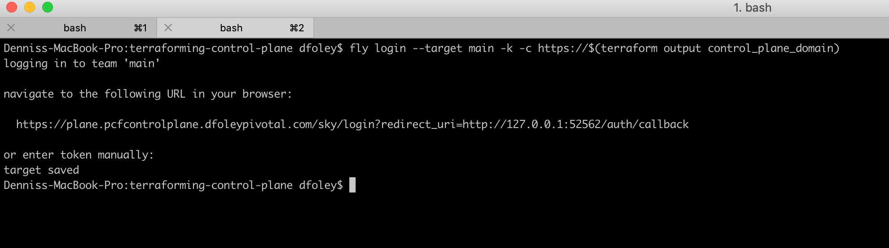


- After authenticating into Concourse, Create a team name **dev** for development pipelines..

```bash
fly set-team -t main -n dev --allow-all-users
```

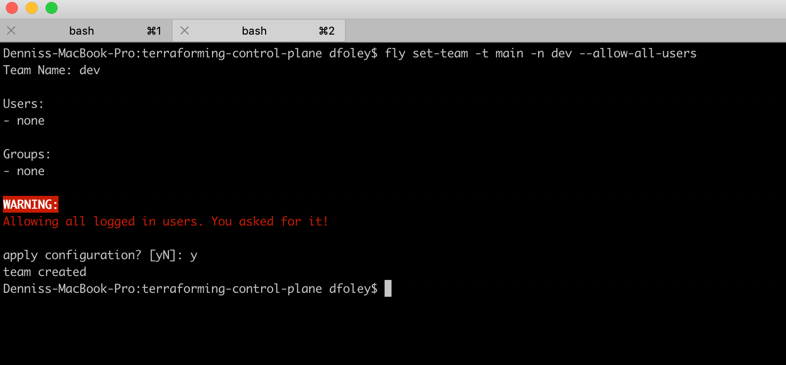

- Login to the new team:

```bash
fly login --target dev -k -c https://$(terraform output control_plane_domain)
```

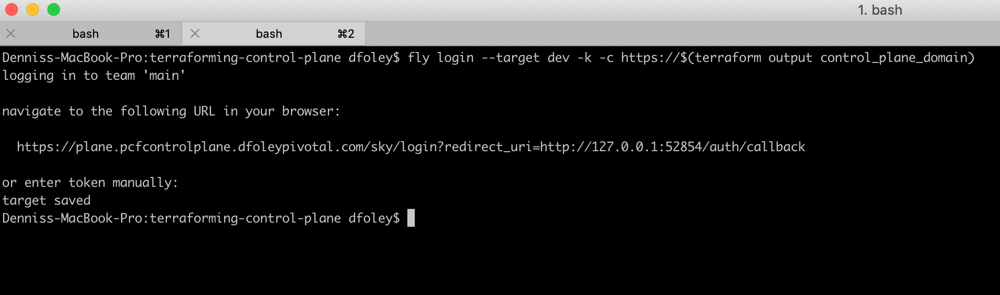

## Deploye Pivotal Cloud Foundry via Platform Automation

### **STEP 7**: Add to Credhub

- If you need to setup your environment run the following commands.

```bash
az login
export OM_TARGET="https://$(terraform output ops_manager_dns)"
export OM_USERNAME="admin"
export OM_PASSWORD="$(terraform output ops_manager_password)"
export OPS_MANAGER_KEY_PATH=./ops_manager_ssh_private_key
eval "$(om --skip-ssl-validation bosh-env --ssh-private-key $OPS_MANAGER_KEY_PATH)"
```

- Set PivNet API Token in Credhub

```bash
credhub login
credhub set --name /pipeline/dev/pivnet-token --type value --value "Your PivNet Token"
```


